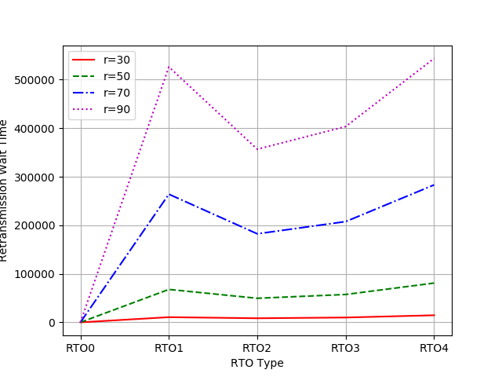

# 0220 Retransmissionの結果について
## シミュレーションについて
- RTOの算出方法を変え，距離(d={30,50,70,90})でシミュレーションを行った．
- RTOの算出方法は以下の通り(RTO_definition.xlsxにて計算)
  - RTO0: Retransmissionなし
  - RTO1: 2 * (median of RTT)
  - RTO2: (median of RTT) + 1/3 * (standard deviation of RTT)
  - RTO3: (median of RTT) + 1/2 * (standard deviation of RTT)
  - RTO4: (median of RTT) + (standard deviation of RTT)
- median of RTTとstandard deviation of RTTは以前に使用した結果の値を使用

- RTOはRTO2 < RTO3 < RTO1 < RTO4となっている

## グラフについて
### compare_jitter_by_rto_each_distance
- 各距離ごとにX軸をRTOの算出方法，Y軸を標準偏差でプロット
- ほとんど，RTO1 > RTO2 <= RTO3である
- 再送信なし(RTO0)よりは再送信した方が早い
- **このグラフからRTO2が一番効率がいいことがわかる**

### compare_mean/median_by_rto_each_distance
- 各距離ごとにX軸をRTOの算出方法，Y軸を平均値/中央値でプロット
- 距離が短い(r=30)の時はほとんど変化が見られない
- 距離が大きい方が起伏が激しい
- meanで見るとRTO2かRTO3が有効的だが，medianで見るとRTO1かRTO4が有効的である

compare_mean_by_rto_each_distance

compare_median_by_rto_each_distance

### compare_jitter_by_retransmission_wait_time_each_distance
- 各距離ごとにX軸を再送信の時間，Y軸を標準偏差でプロット

### compare_mean/median_by_retransmission_wait_time_each_distance
- 各距離ごとにX軸を再送信の時間，Y軸を平均/中央値でプロット

compare_mean_by_retransmission_wait_time_each_distance

compare_median_by_retransmission_wait_time_each_distance

### compare_regression_jitter_by_distance_each_rto
- 各RTOの算出方法ごとにX軸を距離，Y軸に標準偏差でプロットし，回帰式を算出
- 距離が長くなればなるほど，再送信をした方が効率的になる
  - 短い時間で届かなくなるため

compare_regression_jitter_by_distance_each_rto

### compare_regression_mean/median_by_distance_each_rto
- 各RTOの算出方法ごとにX軸を距離，Y軸に平均/中央値でプロットし，回帰式を算出
- 距離が長ければRTO4が一番効率的

compare_regression_mean_by_distance_each_rto

compare_regression_median_by_distance_each_rto

### compare_regression_jitter_by_retransmission_wait_time_each_distance
- 各距離ごとにX軸を再送信の時間，Y軸を標準偏差でプロット

### compare_regression_mean/median_by_retransmission_wait_time_each_distance
- 各距離ごとにX軸を再送信の時間，Y軸を平均/中央値でプロット

compare_regression_mean_by_retransmission_wait_time_each_distance

compare_regression_median_by_retransmission_wait_time_each_distance

